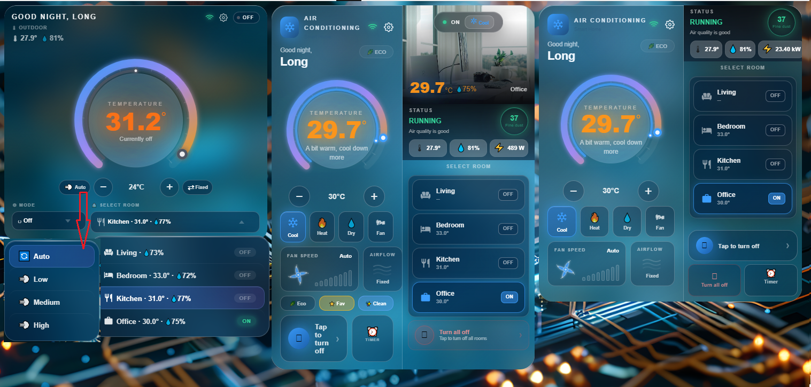
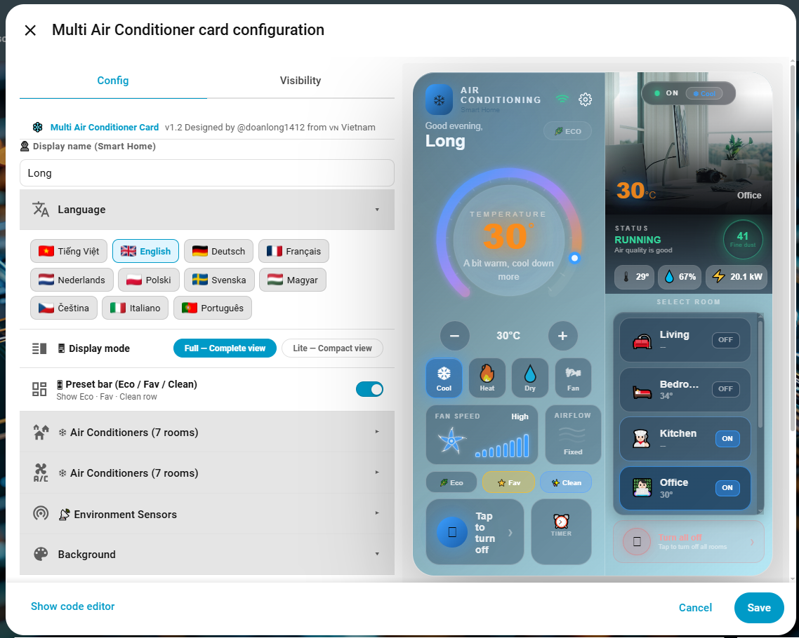

# ❄️ Multi Air Conditioner Card

[](https://github.com/hacs/integration)


> 🇻🇳 **Phiên bản tiếng Việt:** [README_vi.md](README_vi.md)

A custom Home Assistant Lovelace card for multi-room air conditioner control — live temperature dial, fan & swing controls, per-room status tabs, eco mode, timer scheduling, environment sensors, and a full visual editor with up to 8 rooms.

**No extra plugins required. Works standalone, fully configurable through the built-in UI editor.**

---

## 📸 Preview

### 🎬 Demo


### 🖼️ Screenshot


---

## 🎛️ Visual Config Editor



---

## ✨ Features (v1.9)

### 🎨 Display & Interface
- ❄️ **Temperature dial** — animated arc gauge with dynamic colour glow: blue (cold) → cyan → green → orange → red (hot)
- 🔵 **Set-point inner ring** — a second thin arc inside the dial shows the target temperature, coloured by the active HVAC mode
- 🏠 **Room photo panel** — per-room image (default or custom URL) with live ON/OFF overlay badge and colour-matched temperature + humidity badge
- 📊 **Status block** — running state, air quality indicator, PM2.5 ring, outdoor temperature, humidity and power consumption
- 🕐 **Live clock** — real-time date and time display with greeting by time of day
- 🌿 **Eco mode badge** — toggle eco/preset mode directly from the card header

### 🖥️ Three View Modes
- **Full** — complete two-column layout with all panels visible (default)
- **Lite** — compact two-column layout, room photo hidden, ideal for smaller dashboards or mobile
- **Super Lite** ⚡ — ultra-compact single-column layout featuring a large dial, temperature control, HVAC mode selector and room selector; perfect for widgets, sidebars or very narrow spaces

### 🔀 Inline View Switcher
Switch between Full / Lite / Super Lite **directly on the card** without opening the editor. The active mode dot-icons now **bounce in a staggered wave** — Full shows 3 dots bouncing left-to-right, Lite shows 2, Super Lite shows 1 — making the active mode instantly recognisable at a glance.

### ✨ Super Lite Popup Style
When using **Super Lite** mode, the HVAC mode and room selectors support three interaction styles — configurable in the editor:
- **Normal** — native `<select>` dropdown (most compatible, consistent on iOS/Android)
- **Effect** — custom glass-style popup with spring open/close animation
- **Wave** — same glass popup with a wave-ripple entrance animation

### 🎛️ Super Lite Layout
In **Super Lite** mode the temperature control row has dedicated **Fan speed** and **Airflow** shortcut buttons:
- **Fan speed button** — sits to the left of the `−` (decrease) button; tap to cycle fan levels
- **Airflow button** — sits to the right of the `+` (increase) button; tap to cycle swing modes
- **Mode and Room selectors** scale to full card width for maximum legibility on narrow screens

### 🎛️ Per-element Visibility Toggles
Every section of the card can be individually shown or hidden directly from the editor:
- Greeting row, HVAC mode buttons (Cool / Heat / Dry / Fan individually), fan speed panel, airflow panel, Eco/Fav/Clean bar, status & sensor block, outdoor temperature, humidity, power, timer button, turn-all-off button
- **Room Temp / Humidity** (Super Lite) — toggle to show the selected room's temperature and humidity in the Super Lite header instead of outdoor sensor data
- **Room Power** (Super Lite) — toggle to show the selected room's power consumption next to humidity in the header
- **Fan speed / Airflow buttons** (Super Lite) — show or hide individually

### 🌬️ Central AC Damper Control *(New in v1.9)*
For rooms using a centralised AC system, the card now supports controlling **individual air dampers (vents)** per room:
- Enable **Central AC mode** per room (`is_central_ac: true`) in the editor
- Add one or more `cover.*` entities to the room's **dampers** list
- A **Damper button** appears below the Fan Speed / Airflow row — full-width, compact single-line layout showing the icon, label, number of dampers and a live summary (e.g. `1/3 open · Avg 33%`)
- Tapping the button opens a **full damper popup** where each damper can be opened, closed or set to a specific percentage individually
- The summary colour reflects the overall state: cyan when at least one damper is open, dimmed white when all are closed
- The Damper button only appears when **both** conditions are met: `is_central_ac: true` is set **and** at least one valid `cover.*` entity is added to the dampers list

### 📡 Offline / Unavailable Detection *(New in v1.8)*
When an AC unit loses network or power (`unavailable` / `unknown` state), the card clearly reflects this without any manual intervention:
- **Room tab** → flashing red **OFFLINE** badge replaces ON/OFF; sub-text changes to "Offline"; icon dims
- **Temperature dial** → displays `--°` and `📡 Offline` instead of live temperature readings
- **STATUS block** → shows flashing red `OFFLINE` label + "Disconnected, waiting to restore..."
- **Power button** → disabled while entity is unavailable — no accidental HA service calls sent
- **Turn all off** → automatically skips offline rooms; only sends commands to rooms that are reachable
- **Super Lite** — header status badge, room dropdown (all popup styles) all show `OFFLINE`
- **Auto-recovery** — as soon as the AC comes back online and its state changes, the card updates instantly with no reload required
- Applied consistently across all 3 view modes: **Full / Lite / Super Lite**

### 💾 Remember Active Room *(New in v1.8)*
- The card saves the currently selected room to `localStorage` whenever the user switches rooms
- After a **page reload**, **navigating to another dashboard and back**, or **closing and reopening the app** → the card automatically restores the last selected room
- The storage key is scoped to the card's first entity ID — multiple AC cards on the same dashboard each remember their own room independently
- Works across all 3 view modes: room tabs (Full/Lite), room select & room popup (Super Lite)

### ❄️ Multi-Room Control (up to 8 rooms)
- **Room selector tabs** (Full / Lite) — shows MDI icon, name, current temperature and ON/OFF badge; always displays 4 rows, scrollable for more. Tapping a tab shows a **smart tooltip** with temperature, humidity and running state
- **Room selector dropdown** (Super Lite) — compact dropdown / glass popup listing all rooms with live temperature and ON/OFF badge; icons render as `ha-icon` MDI icons
- **Per-room HVAC control** — Cool / Heat / Dry / Fan Only mode buttons with colour-coded active state
- **Temperature set** — `+` / `−` buttons to adjust set-point
- **Fan speed** — cycle through Auto / Low / Medium / High with animated fan blade SVG and bar chart
- **Swing direction** — cycles only through modes actually supported by the entity (reads `swing_modes` attribute)
- **Custom room image** — each room supports a custom photo URL, falling back to built-in defaults

### 🌡️ Per-Room Environment Sensors
Each room supports dedicated temperature, humidity and power sensors independent of the AC entity:
- `entities[n].temp_entity` — override the room's displayed temperature
- `entities[n].humidity_entity` — override the room's displayed humidity
- `entities[n].power_entity` — per-room power consumption sensor; value updates automatically when switching rooms in all three view modes
- Displayed in the room photo badge (Full/Lite) and in the Super Lite header

### ⚡ Power Consumption — Per-Room & Unit Toggle
- Each room has its own power entity (`entities[n].power_entity`) — displayed value updates automatically when switching rooms in Full, Lite and Super Lite modes
- Global `power_entity` acts as fallback when a room has no dedicated sensor
- **Unit selector** in the editor: choose **kW** (sensor value used as-is) or **W** (auto-converts — values ≥ 1000 W display as kW)
- Super Lite: power value shown inline next to humidity in the top-left header area; toggle with `show_sl_room_power`

### 🎨 MDI Room Icons
Room icons use the **Material Design Icons** system (`mdi:*`) matching the native Home Assistant icon style:
- Default icons: `mdi:sofa`, `mdi:bed`, `mdi:silverware-fork-knife`, `mdi:briefcase`, `mdi:shower`, `mdi:teddy-bear`, `mdi:dumbbell`, `mdi:archive`
- Rendered as `<ha-icon>` throughout — tabs (Full/Lite), room button (Super Lite), popup items (Effect & Wave), native select (label only)
- Any `mdi:icon-name` can be entered in the **MDI Icon** field of the visual editor; emoji still accepted as fallback

### 🎇 HVAC Mode Animations
Each HVAC mode button plays a **canvas-rendered particle animation** that travels from the mode button to the centre of the temperature dial — looping every 10 seconds (configurable) while the mode is active:

| Mode | Trail | Burst / Effect |
|------|-------|----------------|
| ❄️ **Cool** | 5 snowflakes + light beam | Ice crystal burst + water droplets |
| 🔥 **Heat** | 4 heat-shimmer rays (zigzag) | Ember particles + expanding halo rings |
| 💧 **Dry** | 18 mist droplets in wavy paths | Mist cloud expands then spirals inward (absorbed) |
| 🌀 **Fan** | 5 offset wind streams (curved) | Triple spiral vortex grows then fades |

All four modes also **keep their icon animation running** after selection (spin, flicker, bounce, blow).

**Repeat interval** is configurable in the editor via the *Snowflake repeat (seconds)* slider (2–15 s, default 10 s).

### ⚡ Turn-All-Off Button
- **Vibrant red gradient** with 3D raised `box-shadow` effect and breathing-pulse glow
- **Hover:** lifts; **Active/tap:** presses down physically
- Automatically **skips offline rooms** — only turns off rooms that are currently reachable

### 🌿 Eco & Quick Actions
- **Eco toggle** — activates eco/preset mode on the selected room's AC unit
- **Quick-action chips** — Eco, Fav, Clean shortcut buttons (Full mode only)

### ⏱️ Timer Scheduling
- **Per-room timer** — 8 preset durations: `30m · 1h · 1.5h · 2h · 3h · 4h · 6h · 8h` + free custom-minute input
- **Schedule on or off** — choose whether the timer turns the AC on or off
- **Countdown display** — live countdown shown on the timer button
- **Persistent timers** — state saved to localStorage, restored after page reload

### 🌐 Multi-language Support (11 languages)
- 🇻🇳 Tiếng Việt / 🇬🇧 English / 🇩🇪 Deutsch / 🇫🇷 Français / 🇳🇱 Nederlands
- 🇵🇱 Polski / 🇸🇪 Svenska / 🇭🇺 Magyar / 🇨🇿 Čeština / 🇮🇹 Italiano / 🇵🇹 Português
- **Real country flag images** in language selector (via flagcdn.com)

### 🎨 Visual Customisation
- **16 background gradient presets** — Default, Night, Sunset, Forest, Aurora, Desert, Ocean, Cherry, Volcano, Galaxy, Ice, Olive, Slate, Rose, Teal, Custom
- **3 colour pickers** — Accent, Text, Background custom colours

---

## 📦 Installation

### Option 1 — HACS (recommended)

**Step 1:** Add Custom Repository to HACS:

[](https://my.home-assistant.io/redirect/hacs_repository/?owner=doanlong1412&repository=multi-air-conditioner-card&category=plugin)

> If the button doesn't work, add manually:
> **HACS → Frontend → ⋮ → Custom repositories**
> → URL: `https://github.com/doanlong1412/multi-air-conditioner-card` → Type: **Dashboard** → Add

**Step 2:** Search for **Multi Air Conditioner Card** → **Install**

**Step 3:** Hard-reload your browser (`Ctrl+Shift+R`)

---

### Option 2 — Manual

1. Download [`multi-air-conditioner-card.js`](https://github.com/doanlong1412/multi-air-conditioner-card/releases/latest)
2. Copy to `/config/www/multi-air-conditioner-card.js`
3. Go to **Settings → Dashboards → Resources** → **Add resource**:
   ```
   URL:  /local/multi-air-conditioner-card.js
   Type: JavaScript module
   ```
4. Hard-reload your browser (`Ctrl+Shift+R`)

---

## ⚙️ Card Configuration

### Step 1 — Add the card to your dashboard

```yaml
type: custom:multi-air-conditioner-card
```

After adding the card, click **✏️ Edit** to open the Config Editor.

### Step 2 — Config Editor sections

| # | Section | Contents |
|---|---------|----------|
| 1 | 🌐 **Language** | 11 languages with real flag images |
| 2 | 🖥️ **View mode** | Full / Lite / Super Lite layout |
| 3 | ✨ **Popup style** | Normal / Effect / Wave (Super Lite only) |
| 4 | 👁️ **Visibility** | Toggle individual sections on or off; power unit selector (kW / W) |
| 5 | 🔢 **Room count** | Slider to set 1–8 rooms |
| 6 | ❄️ **Air Conditioners** | Entity picker, display name, MDI icon, custom image URL, per-room temperature / humidity / power sensors, Central AC toggle, damper entities |
| 7 | 📡 **Environment Sensors** | PM2.5, outdoor temperature, humidity, power (global fallback) |
| 8 | 🎨 **Colors** | Accent, text colours |
| 9 | 🎨 **Background** | 16 gradient presets + custom two-colour picker |

---

## 🔌 Entity Reference

### Room entities (per room, up to 8)

| Config key | Entity type | Description |
|---|---|---|
| `entities[n].entity_id` | `climate` | AC unit entity ✅ |
| `entities[n].label` | string | Display name for the room |
| `entities[n].icon` | string | MDI icon string, e.g. `mdi:sofa` (emoji also accepted) |
| `entities[n].area` | string | Room area label (e.g. `25 m²`) |
| `entities[n].image` | string | Custom room photo URL (optional) |
| `entities[n].temp_entity` | `sensor` | Room temperature sensor (if AC has none) |
| `entities[n].humidity_entity` | `sensor` | Room humidity sensor (if AC has none) |
| `entities[n].power_entity` | `sensor` | Per-room power consumption sensor |
| `entities[n].is_central_ac` | boolean | Enable Central AC mode for this room (shows Damper button) |
| `entities[n].dampers` | array | List of `cover.*` damper entities for this room |
| `entities[n].dampers[m].entity_id` | `cover` | Damper / vent entity ID |
| `entities[n].dampers[m].name` | string | Display name for this damper (optional) |

### Environment sensors (optional)

| Config key | Entity type | Description |
|---|---|---|
| `pm25_entity` | `sensor` | PM2.5 fine dust sensor |
| `outdoor_temp_entity` | `sensor` | Outdoor temperature sensor |
| `humidity_entity` | `sensor` | Outdoor humidity sensor |
| `power_entity` | `sensor` | Global AC power sensor (fallback when room has none) |

---

## ⚙️ Full Config Reference

| Config key | Type | Default | Description |
|---|---|---|---|
| `language` | string | `vi` | `vi`/`en`/`de`/`fr`/`nl`/`pl`/`sv`/`hu`/`cs`/`it`/`pt` |
| `view_mode` | string | `full` | `full` · `lite` · `super_lite` |
| `popup_style` | string | `normal` | Super Lite selector style: `normal` · `effect` · `wave` |
| `room_count` | number | `4` | Number of rooms to display (1–8) |
| `owner_name` | string | `Smart Home` | Owner name shown in greeting |
| `cool_anim_speed` | number | `10000` | HVAC animation repeat interval in ms (2000–15000) |
| `show_greet` | boolean | `true` | Show greeting row |
| `show_cool` | boolean | `true` | Show Cool mode button |
| `show_heat` | boolean | `true` | Show Heat mode button |
| `show_dry` | boolean | `true` | Show Dry mode button |
| `show_fan_only` | boolean | `true` | Show Fan Only mode button |
| `show_fan` | boolean | `true` | Show fan speed panel (Full/Lite) |
| `show_swing` | boolean | `true` | Show airflow direction panel (Full/Lite) |
| `show_preset_bar` | boolean | `true` | Show Eco / Fav / Clean bar |
| `show_status` | boolean | `true` | Show status & sensor block |
| `show_outdoor_temp` | boolean | `true` | Show outdoor temperature metric |
| `show_humidity` | boolean | `true` | Show humidity metric |
| `show_power` | boolean | `true` | Show power consumption metric |
| `show_all_off` | boolean | `true` | Show turn-all-off button |
| `show_timer` | boolean | `true` | Show timer button |
| `show_room_env` | boolean | `false` | Super Lite: show selected room temp & humidity in header |
| `show_sl_fan` | boolean | `true` | Super Lite: show fan speed shortcut button |
| `show_sl_swing` | boolean | `true` | Super Lite: show airflow shortcut button |
| `show_sl_room_power` | boolean | `true` | Super Lite: show per-room power in header |
| `power_unit` | string | `kw` | Power display unit: `kw` or `w` (auto-converts ≥ 1000 W → kW) |
| `background_preset` | string | `default` | Gradient preset name |
| `bg_color1` | hex | `#001e2b` | Custom gradient colour 1 (top-left) |
| `bg_color2` | hex | `#12c6f3` | Custom gradient colour 2 (bottom-right) |
| `accent_color` | hex | `#00ffcc` | Accent / glow colour |
| `text_color` | hex | `#ffffff` | Primary text colour |
| `entities` | array | — | List of room objects (see above) |
| `pm25_entity` | entity | — | PM2.5 sensor |
| `outdoor_temp_entity` | entity | — | Outdoor temperature sensor |
| `humidity_entity` | entity | — | Outdoor humidity sensor |
| `power_entity` | entity | — | Global power sensor (fallback) |

---

## 📝 Full YAML example

```yaml
type: custom:multi-air-conditioner-card
language: en
view_mode: full
room_count: 4
owner_name: My Home
power_unit: kw          # kw | w
cool_anim_speed: 10000  # ms between HVAC animations (2000–15000)

background_preset: default
accent_color: "#00ffcc"
text_color: "#ffffff"

show_greet: true
show_cool: true
show_heat: true
show_dry: true
show_fan_only: true
show_fan: true
show_swing: true
show_preset_bar: true
show_status: true
show_outdoor_temp: true
show_humidity: true
show_power: true
show_all_off: true
show_timer: true

entities:
  - entity_id: climate.living_room_ac
    label: Living Room
    area: "25 m²"
    icon: mdi:sofa
    image: "https://example.com/photos/living.jpg"     # optional custom photo
    temp_entity: sensor.living_room_temperature        # optional room sensor
    humidity_entity: sensor.living_room_humidity       # optional room sensor
    power_entity: sensor.living_room_ac_power          # optional per-room power
    is_central_ac: true                                # enable Central AC damper control
    dampers:
      - entity_id: cover.living_room_vent
        name: Main vent
      - entity_id: cover.living_room_vent_2
        name: Side vent
  - entity_id: climate.bedroom_ac
    label: Bedroom
    area: "18 m²"
    icon: mdi:bed
    power_entity: sensor.bedroom_ac_power
    is_central_ac: true
    dampers:
      - entity_id: cover.bedroom_vent
        name: ""
  - entity_id: climate.kitchen_ac
    label: Kitchen
    area: "20 m²"
    icon: mdi:silverware-fork-knife
  - entity_id: climate.office_ac
    label: Office
    area: "15 m²"
    icon: mdi:briefcase

pm25_entity: sensor.pm25
outdoor_temp_entity: sensor.outdoor_temperature
humidity_entity: sensor.outdoor_humidity
power_entity: sensor.ac_power_kwh                      # global fallback
```

### Super Lite example

```yaml
type: custom:multi-air-conditioner-card
language: en
view_mode: super_lite
popup_style: effect         # normal | effect | wave
show_room_env: true         # show room temp/humidity in header
show_sl_room_power: true    # show per-room power in header
show_sl_fan: true           # fan speed button left of −
show_sl_swing: true         # airflow button right of +
power_unit: w               # display as W, auto-convert ≥ 1000 W to kW
room_count: 4
entities:
  - entity_id: climate.living_room_ac
    label: Living Room
    icon: mdi:sofa
    temp_entity: sensor.living_room_temperature
    humidity_entity: sensor.living_room_humidity
    power_entity: sensor.living_room_ac_power
  - entity_id: climate.bedroom_ac
    label: Bedroom
    icon: mdi:bed
    power_entity: sensor.bedroom_ac_power
```

### Lite mode example

```yaml
type: custom:multi-air-conditioner-card
language: en
view_mode: lite
room_count: 4
entities:
  - entity_id: climate.living_room_ac
    label: Living Room
    icon: mdi:sofa
  - entity_id: climate.bedroom_ac
    label: Bedroom
    icon: mdi:bed
```

---

## 🖥️ Compatibility

| | |
|---|---|
| Home Assistant | 2023.1+ |
| Lovelace | Default & custom dashboards |
| Devices | Mobile & Desktop |
| Dependencies | None — fully standalone |
| Browsers | Chrome, Firefox, Safari, Edge |

---

## 📋 Changelog

### v1.9
- 🌬️ **Central AC Damper Control** — per-room support for controlling individual air dampers/vents in centralised AC systems:
  - Enable per room with `is_central_ac: true` and add any number of `cover.*` entities to the `dampers` list
  - A compact **full-width Damper button** appears below the Fan Speed / Airflow row showing a live summary: number of dampers, open count and average position percentage
  - Tapping opens a **Damper popup** to open, close or precisely set each vent individually
  - Summary colour is cyan when at least one damper is open, dimmed white when all are closed
  - Button only appears when both `is_central_ac: true` and at least one valid `cover.*` entity are configured
- 🐛 **Fix `self` not defined in `_renderFull()`** — the fan/damper IIFE now correctly resolves `self._activeIdx` and `self._config`
- 🐛 **Fix `cfg` not defined in `_bind()` damper popup** — replaced bare `cfg` reference with `self._config` to prevent `ReferenceError` on card load

### v1.8
- 📡 **Offline / Unavailable handling** — when an AC unit loses network or power (`unavailable` / `unknown`):
  - Room tab shows a flashing red **OFFLINE** badge, dimmed icon and "Offline" sub-text instead of temperature
  - Temperature dial shows `--°` and `📡 Offline` instead of live readings
  - STATUS block shows flashing red `OFFLINE` + "Disconnected, waiting to restore..."
  - Power button is disabled while the entity is unavailable — no accidental HA service calls
  - Turn-all-off automatically skips offline rooms
  - Super Lite header badge and all popup styles (Normal / Effect / Wave) reflect the offline state
  - Auto-recovery: card updates instantly as soon as the device comes back online, no reload needed
- 💾 **Remember active room** — the selected room is saved to `localStorage`; after page reload, navigating away and back, or closing and reopening the app the card restores the last selected room automatically; storage key is scoped per card so multiple AC cards on the same dashboard are independent
- 🐛 **Internal fix** — `_stateOf()` now returns the real entity state (`unavailable`) instead of masking it as `off`, ensuring change detection correctly triggers re-renders for all state transitions

### v1.7
- 🎇 **HVAC mode canvas animations** — each active mode plays a looping canvas animation from its button to the temperature dial centre:
  - ❄️ Cool: snowflake trail + ice crystal burst with water droplet splash
  - 🔥 Heat: zigzag heat-shimmer rays + ember particles + expanding halo rings
  - 💧 Dry: wavy mist droplet trail + mist cloud expands then spirals inward (absorbed)
  - 🌀 Fan Only: curved wind streams + triple spiral vortex that grows and fades
- ✨ **Persistent mode icon animations** — Cool, Heat, Dry and Fan icons continue animating after selection, not just on hover
- 🎯 **Staggered dot bounce on view switcher** — active view mode dots bounce in a wave sequence
- 🟥 **Turn-All-Off button redesign** — vibrant red gradient, 3D raised shadow, physical press-down, breathing-pulse glow
- 🐛 **Snowflake trail clip fix** — frame-delta guard prevents animation phase skipping on tab re-focus

### v1.6
- 🔀 **Inline view switcher** — switch between Full / Lite / Super Lite directly on the card header
- 🎨 **MDI room icons** — all room icons use `mdi:*` strings and render as `<ha-icon>` elements
- ⚡ **Per-room power sensor** — `entities[n].power_entity` per room
- 🔢 **Power unit selector** — kW or W, auto-converts ≥ 1000 W
- 📍 **Super Lite power indicator** — toggle with `show_sl_room_power`
- 🐛 Fan blade fix, scale flicker fix, tooltip flicker fix

### v1.5
- 🎛️ **Super Lite layout redesign** — fan speed button left of `−`, airflow button right of `+`

### v1.4
- ⚡ New **Super Lite** view mode
- ✨ **Popup style selector** — Normal / Effect / Wave
- 🌡️ Per-room temperature & humidity sensors
- 🏠 Custom room photo
- 🔵 Set-point inner ring on dial

### v1.3
- 🖥️ New **Lite view mode**
- 👁️ **Per-element visibility toggles**

### v1.2
- 🇵🇹 New language — Português (11 languages total)
- 🌡️ Dynamic temperature colour on dial
- ⏱️ Timer overhaul — 8 preset durations + free custom-minute input
- 🔢 Room tabs enlarged — always shows 4, scrollable for more

### v1.1
- 🔢 Configurable room count — 1 to 8 rooms via editor slider
- 🌐 10-language support with real flag images
- 🎨 16 background gradient presets
- 🎛️ Full visual editor
- 🐛 Focus fix — text inputs no longer lose focus while typing

### v1.0
- 🚀 Initial release — 4-room AC control card

---

## 📄 License

MIT License — free to use, modify, and distribute.
If you find this useful, please ⭐ **star the repo**!

---

## 🙏 Credits

Designed and developed by **[@doanlong1412](https://github.com/doanlong1412)** from 🇻🇳 Vietnam.
